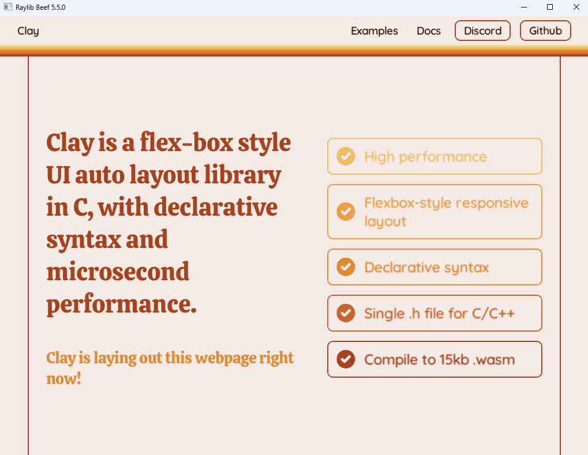

# clay-beef

This repository contains [clay](https://github.com/nicbarker/clay) bindings for the Beef programming language, as well as an example implementation of the [clay website](https://www.nicbarker.com/clay) in Beef.

If you haven't taken a look at the [full documentation](https://github.com/nicbarker/clay/blob/main/README.md) for clay, it's recommended that you take a look there first to familiarise yourself with the general concepts. This README is abbreviated and applies to using clay in Beef specifically.

# Installation

1. Clone this repo somewhere to your system.
2. In the Beef IDE, right-click workspace panel select "Add Existing Project". Locate the directory you just cloned.
3. For each project that will use `clay-beef`, right-click > Properties > Dependencies and check `clay-beef` as a dependency.

# Differences between clay and clay-beef

The **most notable** change in the Beef wrapper is the way that children are handled.

In C, there is a `CLAY` macro provided which will automatically handle nesting elements for you.

In Beef, we have introduced a `UI` helper which takes an element declaration as the first parameter, and an (optional) delegate to render children as the second parameter:

```beef
public static bool UI(ElementDeclaration config, delegate void() children = null)
```

Using it might look something like this:

```beef
UI(.() {
    layout = { ...}
}, scope () => {
    Text("child", .() {
        fontSize = 12
    })
});
```

# Custom renderers

There is an [example raylib](./example/src/renderers/Raylib.bf) renderer that has been implemented in Beef, using [raylib-beef](https://github.com/Starpelly/raylib-beef).

# Example

Running the example requires `raylib-beef` to be added as a project dependency.

